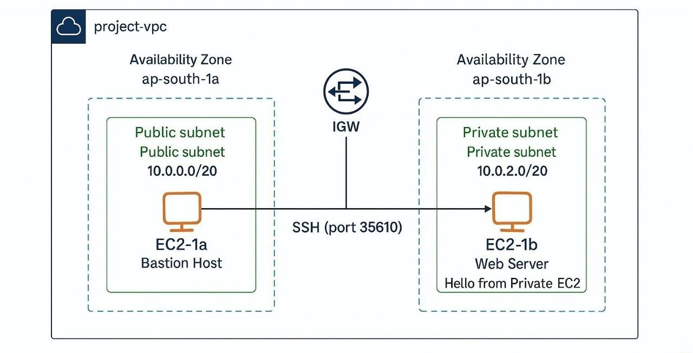

# VPC Networking via NAT Gateway 
**Files in this repo:** `VPC Networking Task via NAT (Anurag Prasad).pdf` & `vpc-architecture.png` 
## 📷Visual Representation

## Contents of the documentation
1. **Project Overview**
2. **Tools & Services Used**
3. **Architecture & Visual Representation**
4. **Implementation Steps**
5. **Validation & Testing**
6. **Challenges & Solutions**
7. **Outcome**

---

## Project Overview
This project demonstrates setting up a secure AWS Virtual Private Cloud (VPC) using public and private subnets and a **NAT Gateway** to provide outbound internet access for private instances while keeping them unreachable from the public internet. A public EC2 instance is used as a jump host (bastion) to access a private EC2 instance where an Apache web server is installed.

Key goals:
- Create VPC, public & private subnets across AZs.  
- Configure Internet Gateway (IGW) and NAT Gateway for controlled access.  
- Launch EC2 instances (public jump host + private instance).  
- Harden SSH access (custom port) and validate private instance internet access via NAT.

---

## Tools & Services Used
- **AWS VPC** (networking)  
- **Subnets (Public & Private)**  
- **Internet Gateway (IGW)**  
- **NAT Gateway**  
- **AWS EC2** (public + private instances)  
- **Apache httpd** (web server on private EC2)  
- **AWS CLI** (optional: for automation)

***For more details, please refer to the full documentation PDF***

**Author:** Anurag Prasad
🔗https://www.linkedin.com/in/anurag-prasad1611/
